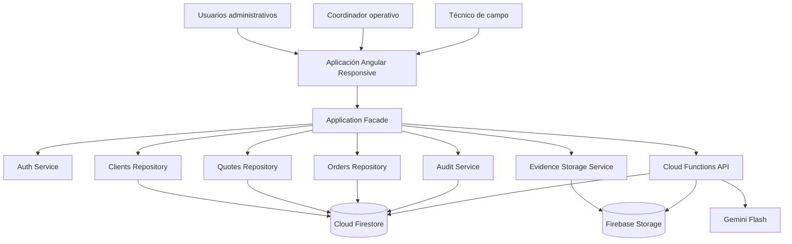
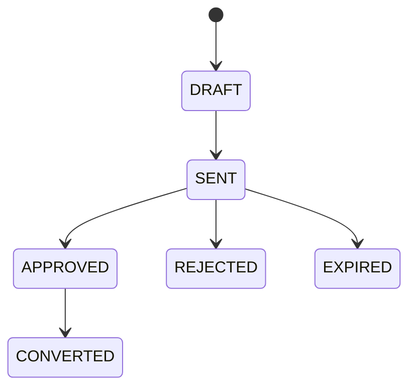
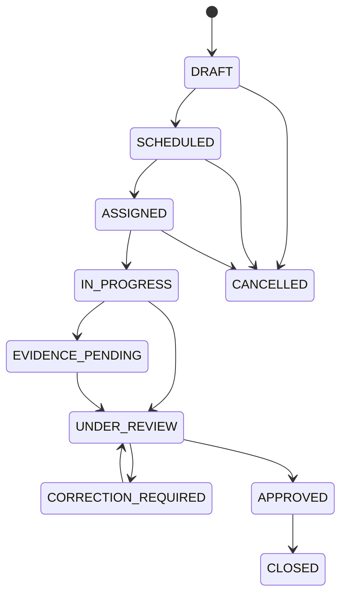
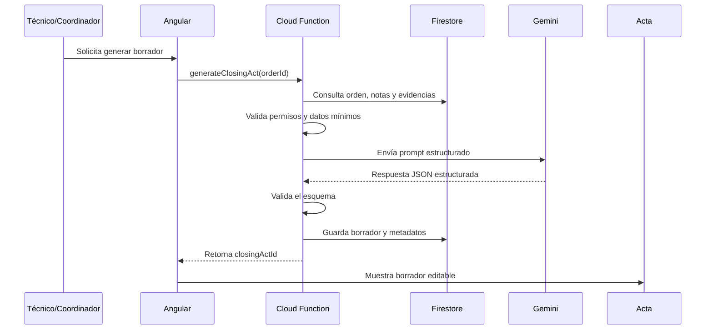

# CLAUDE.md — MVP Plataforma SOTER HSEQ

> **Documento técnico principal para Claude Code**
> **Proyecto:** Plataforma Digital SOTER HSEQ
> **Versión:** 1.0
> **Fecha:** Julio de 2026
> **Estado:** Definición inicial del MVP

---

## 1. Instrucción principal

Construye un **MVP web funcional** para digitalizar el ciclo operativo principal de SOTER HSEQ:

```text
Cliente
→ Cotización
→ Aprobación
→ Orden de servicio
→ Asignación de técnico
→ Ejecución en campo
→ Evidencias
→ Notas técnicas
→ Borrador de acta generado con IA
→ Revisión humana
→ Cierre
```

La prioridad es entregar una aplicación:

- Fácil de entender y mantener.
- Segura desde su primera versión.
- Responsive para escritorio, tableta y celular.
- Orientada a una demo empresarial real.
- Sin microservicios ni infraestructura innecesaria.
- Preparada para crecer sin reconstruir el proyecto.

No agregues funcionalidades fuera del alcance sin documentarlas primero como propuesta.

---

## 2. Objetivo del producto

Centralizar en una sola plataforma la información relacionada con clientes, cotizaciones, órdenes de servicio, técnicos, evidencias y actas de cierre.

El MVP debe reducir:

- Elaboración manual de documentos.
- Pérdida de fotografías y archivos.
- Duplicidad de información.
- Falta de trazabilidad.
- Demoras entre la operación de campo y el área administrativa.
- Inconsistencias en las actas entregadas al cliente.

---

## 3. Usuarios y roles

### 3.1 Administrador

Puede:

- Gestionar usuarios y roles.
- Consultar todos los clientes.
- Consultar y modificar cotizaciones.
- Consultar y modificar órdenes.
- Asignar técnicos.
- Revisar y aprobar actas.
- Consultar indicadores.
- Configurar parámetros básicos.

### 3.2 Comercial

Puede:

- Crear y actualizar clientes.
- Crear cotizaciones.
- Enviar cotizaciones.
- Marcar cotizaciones como aprobadas o rechazadas.
- Convertir una cotización aprobada en orden.
- Consultar las órdenes asociadas a sus clientes.

No puede:

- Administrar usuarios.
- Cerrar órdenes técnicamente.
- Aprobar actas finales, salvo autorización explícita.

### 3.3 Coordinador operativo

Puede:

- Consultar órdenes.
- Asignar y reasignar técnicos.
- Programar fechas de ejecución.
- Revisar notas y evidencias.
- Solicitar correcciones.
- Aprobar el acta de cierre.
- Cerrar la orden.

### 3.4 Técnico de campo

Puede:

- Consultar únicamente las órdenes asignadas.
- Iniciar y finalizar una visita.
- Registrar notas técnicas.
- Registrar hallazgos y recomendaciones.
- Subir fotografías y archivos.
- Solicitar la generación del borrador del acta.
- Enviar la orden a revisión.

No puede:

- Ver cotizaciones con información financiera completa, salvo que el negocio lo autorice.
- Aprobar el acta final.
- Gestionar usuarios.
- Consultar órdenes de otros técnicos.

### 3.5 Usuario de consulta

Puede:

- Consultar información autorizada.
- Descargar actas aprobadas.
- Consultar el historial de órdenes permitido.

No puede editar información.

---

## 4. Alcance funcional del MVP

### Incluido

1. Autenticación.
2. Control de acceso por roles.
3. Gestión básica de usuarios.
4. Gestión de clientes.
5. Gestión de contactos del cliente.
6. Gestión de cotizaciones.
7. Gestión de ítems de cotización.
8. Conversión de cotización aprobada a orden.
9. Gestión de órdenes de servicio.
10. Asignación de técnicos.
11. Cambio controlado de estados.
12. Registro de notas técnicas.
13. Carga de evidencias.
14. Bitácora de cambios.
15. Generación de borrador del acta con IA.
16. Revisión y edición humana del acta.
17. Aprobación y cierre.
18. Generación o exportación del acta a PDF.
19. Dashboard básico.
20. Diseño responsive.

### Fuera del MVP

No implementar inicialmente:

- Facturación electrónica.
- Nómina.
- Contabilidad.
- Inventario avanzado.
- Firma digital certificada.
- Aplicación móvil nativa.
- Modo offline completo.
- Integración con WhatsApp.
- Integración con ERP.
- Integración con CRM externo.
- Geolocalización en tiempo real.
- Portal completo para clientes.
- Analítica avanzada.
- Flujos de aprobación multinivel.
- Microservicios.
- Kubernetes.
- Servidores virtuales administrados manualmente.
- AWS, salvo que se solicite una migración futura.

Estas funciones deben registrarse en el backlog, no implementarse de manera anticipada.

---

## 5. Stack tecnológico obligatorio

### Frontend

- Angular 19 o superior.
- TypeScript con modo estricto.
- Angular Signals para estado local y derivado.
- Reactive Forms.
- Angular Router.
- Standalone Components.
- SCSS o CSS moderno.
- Diseño responsive mobile-first.
- Angular Material, PrimeNG o componentes propios, pero elegir una sola estrategia visual principal.

### Backend administrado

- Firebase Authentication.
- Cloud Firestore.
- Firebase Storage.
- Firebase Cloud Functions o Cloud Run Functions para operaciones privilegiadas.
- Firebase Hosting para la demo.

### Inteligencia artificial

- Modelo Gemini tipo Flash, configurable mediante variable de entorno.
- La llamada a Gemini debe ejecutarse únicamente desde backend.
- Nunca exponer una API key de IA en Angular.
- El resultado de IA siempre será un borrador sujeto a revisión humana.

### Pruebas

- Pruebas unitarias para servicios, fachadas y reglas críticas.
- Pruebas de integración para Cloud Functions.
- Pruebas end-to-end para el flujo principal.
- Usar la herramienta de pruebas compatible con la versión del proyecto y documentar la decisión.

---

## 6. Principios de arquitectura

### 6.1 Arquitectura general



### 6.2 Capas

```text
Presentación
→ Fachadas de aplicación
→ Servicios de dominio
→ Repositorios e integraciones
→ Firebase y servicios externos
```

#### Presentación

Contiene:

- Páginas.
- Componentes visuales.
- Formularios.
- Navegación.
- Validaciones de interfaz.
- Estados de carga y error.

No debe:

- Ejecutar consultas directas complejas.
- Contener reglas de negocio críticas.
- Invocar Gemini.
- Decidir permisos únicamente desde el frontend.

#### Fachadas de aplicación

Cada módulo debe exponer una fachada clara.

Ejemplos:

```text
AuthFacade
ClientsFacade
QuotesFacade
OrdersFacade
EvidenceFacade
ClosingActFacade
DashboardFacade
```

Responsabilidades:

- Coordinar casos de uso.
- Exponer Signals de estado.
- Encapsular repositorios y servicios.
- Centralizar loading, error y success.
- Mantener los componentes simples.
- Evitar que una pantalla conozca detalles de Firebase.

No crear una única fachada gigantesca para toda la aplicación. El patrón Facade debe aplicarse por dominio funcional.

#### Servicios de dominio

Contienen reglas como:

- Validación de transiciones de estado.
- Cálculo de totales.
- Validación de cierre.
- Preparación de información para IA.
- Validación de evidencias mínimas.
- Construcción del contenido del acta.

#### Repositorios

Encapsulan Firestore y Storage.

Ejemplos:

```text
ClientsRepository
QuotesRepository
OrdersRepository
UsersRepository
AuditRepository
EvidenceRepository
```

No usar Firestore directamente desde componentes.

#### Backend privilegiado

Las siguientes acciones deben ejecutarse en Cloud Functions:

- Invocación a Gemini.
- Asignación o modificación de custom claims.
- Generación de documentos finales cuando requiera datos protegidos.
- Operaciones administrativas sensibles.
- Validaciones de cierre que no deban depender del cliente.
- Creación de registros derivados críticos.
- Procesos que requieran secretos.

---

## 7. Estructura recomendada del repositorio

```text
soter-hseq-angular/
├── CLAUDE.md
├── README.md
├── firebase.json
├── firestore.rules
├── firestore.indexes.json
├── storage.rules
├── .firebaserc
├── .env.example
├── docs/
│   ├── architecture.md
│   ├── firestore-model.md
│   ├── security.md
│   ├── user-flows.md
│   ├── api-contracts.md
│   ├── testing.md
│   └── decisions/
│       └── ADR-001-initial-architecture.md
├── apps/
│   └── web/
│       ├── src/
│       │   ├── app/
│       │   │   ├── core/
│       │   │   ├── shared/
│       │   │   ├── layout/
│       │   │   ├── features/
│       │   │   │   ├── auth/
│       │   │   │   ├── dashboard/
│       │   │   │   ├── clients/
│       │   │   │   ├── quotes/
│       │   │   │   ├── orders/
│       │   │   │   ├── evidence/
│       │   │   │   ├── closing-acts/
│       │   │   │   └── users/
│       │   │   └── app.routes.ts
│       │   └── environments/
│       └── package.json
├── functions/
│   ├── src/
│   │   ├── auth/
│   │   ├── closing-acts/
│   │   ├── documents/
│   │   ├── shared/
│   │   └── index.ts
│   └── package.json
└── scripts/
    ├── seed-emulator.ts
    └── create-admin.ts
```

Puede utilizarse un workspace simple o monorepo. No agregar complejidad si no aporta valor al MVP.

---

## 8. Convenciones de código

- TypeScript estricto.
- Evitar `any`.
- Usar interfaces o tipos explícitos.
- Usar nombres de dominio en inglés dentro del código.
- Mostrar textos de interfaz en español.
- No duplicar reglas de negocio.
- No crear componentes de más de una responsabilidad.
- No colocar lógica de negocio en templates.
- Evitar suscripciones manuales innecesarias.
- Preferir Signals y flujos reactivos claros.
- Manejar estados de carga, vacío y error.
- Mostrar mensajes de error útiles para el usuario.
- Registrar errores técnicos sin exponer información sensible.
- Usar timestamps del servidor.
- Nunca confiar en fechas o roles enviados únicamente por el cliente.
- Mantener funciones pequeñas y nombres descriptivos.
- Documentar decisiones técnicas no evidentes.

---

## 9. Modelo de datos de Firestore

### 9.1 Principios

- Usar documentos simples y legibles.
- Evitar anidaciones excesivas.
- Denormalizar únicamente cuando mejore consultas reales.
- Guardar identificadores y campos resumidos cuando sea necesario para listados.
- Usar `createdAt`, `createdBy`, `updatedAt` y `updatedBy`.
- Usar timestamps del servidor.
- No borrar información operativa crítica físicamente en el MVP.
- Utilizar estados como `ACTIVE`, `INACTIVE` o `ARCHIVED`.
- Mantener bitácora de eventos importantes.

---

### 9.2 Colección `users`

```ts
interface AppUser {
  id: string;
  uid: string;
  displayName: string;
  email: string;
  phone?: string;
  role: 'ADMIN' | 'COMMERCIAL' | 'COORDINATOR' | 'TECHNICIAN' | 'VIEWER';
  status: 'ACTIVE' | 'INACTIVE';
  photoUrl?: string;
  createdAt: Timestamp;
  createdBy: string;
  updatedAt: Timestamp;
  updatedBy: string;
}
```

Reglas:

- El `uid` debe coincidir con Firebase Authentication.
- El rol real debe validarse mediante custom claims o mecanismo backend confiable.
- Un usuario no puede cambiar su propio rol desde el frontend.

---

### 9.3 Colección `clients`

```ts
interface Client {
  id: string;
  businessName: string;
  legalName?: string;
  taxId: string;
  email?: string;
  phone?: string;
  address?: string;
  city?: string;
  contactIds?: string[];
  notes?: string;
  status: 'ACTIVE' | 'INACTIVE';
  createdAt: Timestamp;
  createdBy: string;
  updatedAt: Timestamp;
  updatedBy: string;
}
```

Subcolección opcional:

```text
clients/{clientId}/contacts/{contactId}
```

```ts
interface ClientContact {
  id: string;
  name: string;
  position?: string;
  email?: string;
  phone?: string;
  isPrimary: boolean;
  status: 'ACTIVE' | 'INACTIVE';
}
```

Cada cliente puede registrar sus sedes y el responsable principal de cada una:

```text
clients/{clientId}/sites/{siteId}
```

```ts
interface ClientSite {
  id: string;
  name: string;
  address: string;
  city: string;
  responsible: {
    name: string;
    position?: string;
    email?: string;
    phone: string;
  };
  status: 'ACTIVE' | 'INACTIVE';
  createdAt: Timestamp;
  createdBy: string;
  updatedAt: Timestamp;
  updatedBy: string;
}
```

---

### 9.4 Colección `quotes`

```ts
interface Quote {
  id: string;
  quoteNumber: string;
  clientId: string;
  clientBusinessName: string;
  contactId?: string;
  status:
    | 'DRAFT'
    | 'SENT'
    | 'APPROVED'
    | 'REJECTED'
    | 'EXPIRED'
    | 'CONVERTED';
  issueDate: Timestamp;
  validUntil?: Timestamp;
  currency: 'COP' | 'USD';
  subtotal: number;
  tax: number;
  discount: number;
  total: number;
  notes?: string;
  terms?: string;
  orderId?: string;
  createdAt: Timestamp;
  createdBy: string;
  updatedAt: Timestamp;
  updatedBy: string;
}
```

Subcolección:

```text
quotes/{quoteId}/items/{itemId}
```

```ts
interface QuoteItem {
  id: string;
  serviceCode?: string;
  description: string;
  quantity: number;
  unitPrice: number;
  taxRate: number;
  subtotal: number;
  total: number;
  position: number;
}
```

Reglas:

- Los totales deben recalcularse en una única función de dominio.
- Una cotización `APPROVED` no puede editar sus valores sin regresar a borrador mediante una acción autorizada.
- Una cotización solo puede convertirse una vez.
- Al convertirla debe quedar `CONVERTED` y guardar `orderId`.

---

### 9.5 Colección `orders`

```ts
interface ServiceOrder {
  id: string;
  orderNumber: string;
  quoteId: string;
  clientId: string;
  clientBusinessName: string;
  assignedTechnicianIds: string[];
  coordinatorId?: string;
  scheduledStart?: Timestamp;
  scheduledEnd?: Timestamp;
  actualStart?: Timestamp;
  actualEnd?: Timestamp;
  serviceAddress?: string;
  city?: string;
  status:
    | 'DRAFT'
    | 'SCHEDULED'
    | 'ASSIGNED'
    | 'IN_PROGRESS'
    | 'EVIDENCE_PENDING'
    | 'UNDER_REVIEW'
    | 'CORRECTION_REQUIRED'
    | 'APPROVED'
    | 'CLOSED'
    | 'CANCELLED';
  serviceSummary: string;
  technicalNotes?: string;
  findings?: string[];
  recommendations?: string[];
  evidenceCount: number;
  closingActId?: string;
  createdAt: Timestamp;
  createdBy: string;
  updatedAt: Timestamp;
  updatedBy: string;
}
```

Subcolecciones recomendadas:

```text
orders/{orderId}/notes/{noteId}
orders/{orderId}/evidence/{evidenceId}
orders/{orderId}/events/{eventId}
```

---

### 9.6 Evidencias

```ts
interface Evidence {
  id: string;
  orderId: string;
  type: 'PHOTO' | 'PDF' | 'DOCUMENT' | 'OTHER';
  category?:
    | 'BEFORE'
    | 'DURING'
    | 'AFTER'
    | 'FINDING'
    | 'SUPPORTING_DOCUMENT';
  fileName: string;
  storagePath: string;
  downloadUrl?: string;
  contentType: string;
  size: number;
  description?: string;
  capturedAt?: Timestamp;
  uploadedAt: Timestamp;
  uploadedBy: string;
  status: 'ACTIVE' | 'REMOVED';
}
```

El `storagePath` debe seguir una convención:

```text
orders/{orderId}/evidence/{evidenceId}/{safeFileName}
```

No confiar en el nombre original del archivo para construir rutas.

---

### 9.7 Notas técnicas

```ts
interface TechnicalNote {
  id: string;
  orderId: string;
  content: string;
  noteType: 'GENERAL' | 'FINDING' | 'ACTIVITY' | 'RECOMMENDATION';
  createdAt: Timestamp;
  createdBy: string;
  updatedAt?: Timestamp;
  updatedBy?: string;
}
```

---

### 9.8 Actas de cierre

```ts
interface ClosingAct {
  id: string;
  orderId: string;
  version: number;
  status: 'DRAFT' | 'AI_GENERATED' | 'UNDER_REVIEW' | 'APPROVED' | 'FINAL';
  source: 'MANUAL' | 'AI_ASSISTED';
  title: string;
  executiveSummary: string;
  performedActivities: string[];
  findings: string[];
  recommendations: string[];
  conclusions?: string;
  limitations?: string;
  generatedText?: string;
  reviewedText?: string;
  modelName?: string;
  promptVersion?: string;
  generatedAt?: Timestamp;
  generatedBy?: string;
  reviewedAt?: Timestamp;
  reviewedBy?: string;
  approvedAt?: Timestamp;
  approvedBy?: string;
  finalPdfStoragePath?: string;
  createdAt: Timestamp;
  createdBy: string;
  updatedAt: Timestamp;
  updatedBy: string;
}
```

Conservar:

- Versión del prompt.
- Modelo utilizado.
- Fecha de generación.
- Usuario que solicitó la generación.
- Usuario que revisó.
- Texto generado y texto aprobado.
- Versiones anteriores cuando se regenere.

---

### 9.9 Bitácora

```ts
interface AuditEvent {
  id: string;
  entityType: 'CLIENT' | 'QUOTE' | 'ORDER' | 'EVIDENCE' | 'CLOSING_ACT' | 'USER';
  entityId: string;
  action: string;
  description: string;
  metadata?: Record<string, unknown>;
  createdAt: Timestamp;
  createdBy: string;
}
```

Ejemplos de acciones:

```text
QUOTE_CREATED
QUOTE_SENT
QUOTE_APPROVED
QUOTE_CONVERTED
ORDER_ASSIGNED
ORDER_STARTED
EVIDENCE_UPLOADED
ACT_GENERATED
ACT_CORRECTION_REQUESTED
ACT_APPROVED
ORDER_CLOSED
```

---

## 10. Flujo de estados

### 10.1 Cotización



Reglas:

- Solo `DRAFT` puede editarse libremente.
- `SENT` puede aprobarse, rechazarse o expirar.
- Solo `APPROVED` puede convertirse en orden.
- `CONVERTED` no puede volver a convertirse.

---

### 10.2 Orden



Reglas mínimas:

- No iniciar sin técnico asignado.
- No enviar a revisión sin notas.
- No enviar a revisión sin evidencia mínima configurable.
- No aprobar sin acta.
- No cerrar sin acta aprobada.
- Una orden cerrada es de solo lectura, excepto para administradores mediante una acción auditada.
- Las transiciones críticas deben validarse también en backend.

---

## 11. Flujos principales

### 11.1 Crear cliente

1. Usuario autorizado abre el formulario.
2. Registra razón social y NIT.
3. El sistema valida campos.
4. El sistema verifica duplicados por NIT.
5. Guarda el cliente.
6. Registra evento `CLIENT_CREATED`.
7. Redirige al detalle.

### 11.2 Crear cotización

1. Seleccionar cliente.
2. Agregar uno o varios servicios.
3. Calcular subtotal, impuestos, descuentos y total.
4. Guardar como borrador.
5. Permitir vista previa.
6. Cambiar a enviada.
7. Registrar eventos.

### 11.3 Convertir cotización en orden

Esta acción debe ser idempotente.

1. Verificar que la cotización esté aprobada.
2. Verificar que no tenga `orderId`.
3. Crear la orden.
4. Copiar los datos relevantes del cliente y servicios.
5. Actualizar la cotización como `CONVERTED`.
6. Guardar `orderId`.
7. Registrar ambos eventos.
8. Retornar la orden creada.

Idealmente ejecutar como transacción o función backend.

### 11.4 Ejecutar orden en campo

1. Técnico consulta sus órdenes.
2. Abre una orden asignada.
3. Inicia la ejecución.
4. Registra notas.
5. Sube evidencias.
6. Registra hallazgos y recomendaciones.
7. Revisa que la información esté completa.
8. Envía a revisión.

### 11.5 Generar borrador con IA



### 11.6 Aprobar y cerrar

1. Coordinador revisa el borrador.
2. Edita cualquier error.
3. Guarda la versión revisada.
4. Aprueba el acta.
5. Genera el PDF.
6. Guarda el PDF en Storage.
7. Actualiza el acta a `FINAL`.
8. Actualiza la orden a `CLOSED`.
9. Registra eventos de aprobación y cierre.

---

## 12. Integración con Gemini

### 12.1 Regla de seguridad

Nunca llamar Gemini directamente desde el navegador.

La arquitectura debe ser:

```text
Angular
→ Callable Function o endpoint autenticado
→ Validación de usuario y rol
→ Lectura de Firestore
→ Gemini
→ Validación estructural
→ Firestore
```

### 12.2 Datos enviados

Enviar únicamente los datos necesarios:

- Resumen del servicio.
- Notas técnicas.
- Actividades.
- Hallazgos.
- Recomendaciones.
- Datos generales no sensibles requeridos para el documento.
- Tipo de servicio.
- Plantilla de salida.

Evitar enviar:

- Credenciales.
- Tokens.
- Datos internos innecesarios.
- Archivos completos sin justificación.
- Información personal que no sea requerida.

### 12.3 Respuesta estructurada

Solicitar JSON con un esquema similar:

```json
{
  "executiveSummary": "string",
  "performedActivities": ["string"],
  "findings": ["string"],
  "recommendations": ["string"],
  "conclusions": "string",
  "limitations": "string"
}
```

Validar la respuesta con un esquema antes de guardarla.

Si la IA devuelve una respuesta inválida:

1. Registrar el error técnico.
2. No sobrescribir un acta válida.
3. Mostrar un mensaje claro.
4. Permitir reintento controlado.
5. Ofrecer edición manual.

### 12.4 Prompt base

```text
Actúas como asistente de redacción técnica para una empresa HSEQ.

Tu tarea es transformar notas de campo en un borrador formal y corporativo.
No inventes hechos, mediciones, normas, fechas, personas ni conclusiones.
Conserva el significado original.
Cuando la información sea insuficiente, indícalo explícitamente.
Separa actividades, hallazgos, recomendaciones, conclusiones y limitaciones.
Devuelve únicamente JSON válido conforme al esquema solicitado.
```

El prompt debe versionarse, por ejemplo:

```text
closing-act-v1
```

---

## 13. Seguridad

### 13.1 Autenticación

- Usar Firebase Authentication.
- Para el MVP puede utilizarse correo y contraseña.
- Preparar la arquitectura para autenticación empresarial futura.
- Verificar email cuando aplique.
- Implementar recuperación de contraseña.

### 13.2 Autorización

- No confiar únicamente en guards de Angular.
- Usar reglas de Firestore.
- Usar reglas de Storage.
- Validar roles en Cloud Functions.
- Utilizar custom claims o una fuente autorizada equivalente.

### 13.3 Firestore Rules

Principios mínimos:

- Usuarios autenticados únicamente.
- Técnicos solo leen órdenes asignadas.
- Técnicos solo crean evidencias en órdenes asignadas y abiertas.
- Técnicos no aprueban actas.
- Comerciales no modifican órdenes cerradas.
- Coordinadores administran órdenes.
- Solo administradores cambian roles.
- Los campos críticos deben limitarse cuando sea viable.

Las reglas deben probarse con emuladores.

### 13.4 Storage Rules

- Validar usuario autenticado.
- Validar pertenencia o rol.
- Limitar tamaño de archivo.
- Limitar tipos MIME permitidos.
- No permitir ejecutables.
- Evitar rutas arbitrarias.
- No exponer archivos de manera pública por defecto.

Tipos iniciales:

```text
image/jpeg
image/png
image/webp
application/pdf
```

Límites sugeridos para el MVP:

```text
Imágenes: 10 MB por archivo
PDF: 20 MB por archivo
```

Estos valores deben ser configurables.

### 13.5 Secretos

No guardar secretos en:

- Repositorio.
- Código Angular.
- Archivos de configuración públicos.
- Firestore.
- Logs.

Usar:

- Secret Manager.
- Secretos de Firebase Functions.
- Variables de entorno seguras.

---

## 14. Pantallas mínimas

### Públicas

- Inicio de sesión.
- Recuperar contraseña.
- Acceso denegado.
- Página no encontrada.

### Privadas

- Dashboard.
- Clientes: listado, creación, edición y detalle.
- Cotizaciones: listado, creación, edición, vista previa y detalle.
- Órdenes: listado, detalle, asignación y ejecución.
- Mis órdenes: vista optimizada para técnicos.
- Evidencias: carga, listado y vista previa.
- Acta de cierre: generación, edición, revisión y aprobación.
- Usuarios: listado y administración básica.
- Perfil del usuario.

---

## 15. Requisitos de interfaz

- Responsive desde 360 px.
- Acciones principales visibles.
- Formularios con validaciones claras.
- Confirmación antes de acciones destructivas.
- Estados mostrados con etiquetas consistentes.
- Tablas adaptables a móvil.
- En móvil, priorizar tarjetas sobre tablas extensas.
- Subida de imágenes sencilla.
- Mostrar progreso de carga.
- Permitir reintento.
- Vista previa de evidencias.
- Mantener accesibilidad básica.
- Buen contraste.
- Navegación con teclado cuando aplique.
- Etiquetas y mensajes en español.
- Fechas en formato local.
- Moneda con formato correcto.
- Evitar interfaces saturadas.

---

## 16. Dashboard del MVP

Mostrar como mínimo:

- Cotizaciones por estado.
- Órdenes por estado.
- Órdenes programadas próximas.
- Órdenes pendientes de revisión.
- Órdenes con corrección requerida.
- Órdenes cerradas recientemente.
- Accesos rápidos según el rol.

No construir analítica avanzada.

---

## 17. Manejo de errores

Crear un modelo común:

```ts
interface AppError {
  code: string;
  message: string;
  technicalMessage?: string;
  context?: Record<string, unknown>;
}
```

Requisitos:

- Traducir errores técnicos a mensajes comprensibles.
- No mostrar stack traces al usuario.
- Registrar contexto sin datos sensibles.
- Diferenciar validación, permisos, red, almacenamiento e IA.
- Permitir reintentar operaciones recuperables.
- No perder datos de formularios por errores temporales.

---

## 18. Observabilidad y auditoría

Para el MVP:

- Logs estructurados en Cloud Functions.
- Correlation ID para generación de actas.
- Registro de errores de IA.
- Registro de transiciones de estado.
- Registro de acciones de aprobación.
- Auditoría de cambios sensibles.
- No registrar contenido sensible completo en logs.

---

## 19. Variables de entorno

Crear `.env.example` sin valores reales:

```env
# Angular / Firebase public config
FIREBASE_API_KEY=
FIREBASE_AUTH_DOMAIN=
FIREBASE_PROJECT_ID=
FIREBASE_STORAGE_BUCKET=
FIREBASE_MESSAGING_SENDER_ID=
FIREBASE_APP_ID=

# Backend only
GEMINI_MODEL=
GEMINI_API_KEY=
APP_BASE_URL=
DEFAULT_EVIDENCE_MIN_COUNT=1
MAX_IMAGE_SIZE_MB=10
MAX_PDF_SIZE_MB=20
```

La clave de Gemini debe existir únicamente en backend.

---

## 20. Estrategia de ambientes

Mínimo:

```text
local
demo
production
```

### Local

- Firebase Emulator Suite.
- Datos semilla.
- Usuarios de prueba.
- Storage emulado cuando sea posible.

### Demo

- Proyecto Firebase separado.
- Información ficticia o autorizada.
- Reglas similares a producción.
- Monitoreo de cuotas.

### Producción

No mezclar con demo.

---

## 21. Datos de prueba

Crear datos semilla:

- 1 administrador.
- 1 comercial.
- 1 coordinador.
- 2 técnicos.
- 3 clientes.
- 4 cotizaciones con estados diferentes.
- 5 órdenes con estados diferentes.
- Evidencias de ejemplo.
- 1 acta generada.
- 1 acta pendiente de revisión.

No usar datos personales reales.

---

## 22. Criterios de aceptación generales

Una historia no se considera terminada hasta que:

- Compila sin errores.
- Pasa lint.
- Tiene pruebas relevantes.
- Cumple permisos.
- Maneja loading, vacío y error.
- Es responsive.
- Tiene mensajes en español.
- No expone secretos.
- No introduce warnings críticos.
- Actualiza documentación.
- Puede demostrarse de principio a fin.
- No rompe el flujo principal.

---

## 23. Criterios de aceptación por módulo

### 23.1 Autenticación

- Un usuario puede iniciar sesión.
- Un usuario inactivo no puede acceder.
- El sistema redirige según autenticación.
- Los guards bloquean rutas.
- Las reglas backend bloquean accesos no autorizados.
- Existe recuperación de contraseña.

### 23.2 Clientes

- Crear cliente con NIT único.
- Editar información.
- Buscar por nombre o NIT.
- Consultar historial asociado.
- No eliminar físicamente clientes con historial.

### 23.3 Cotizaciones

- Crear borrador.
- Agregar, editar y ordenar ítems.
- Calcular totales.
- Cambiar a enviada.
- Aprobar o rechazar.
- Convertir una sola vez.
- Registrar bitácora.
- Bloquear transiciones inválidas.

### 23.4 Órdenes

- Crear desde cotización aprobada.
- Asignar técnico.
- Programar fecha.
- Consultar por estado.
- Técnico solo ve órdenes asignadas.
- Cambiar de estado respetando reglas.
- Registrar historial.

### 23.5 Evidencias

- Subir imágenes y PDF.
- Validar formato y tamaño.
- Mostrar progreso.
- Mostrar vista previa.
- Asociar a la orden correcta.
- Bloquear cargas en órdenes cerradas.
- Registrar auditoría.

### 23.6 IA y acta

- Solo usuarios autorizados generan.
- La función valida datos mínimos.
- El modelo es configurable.
- La respuesta se valida.
- Se guarda el borrador.
- El usuario puede editarlo.
- La IA no cierra la orden.
- La aprobación es humana.
- Se conserva auditoría y versión.
- Un fallo de IA no bloquea el cierre manual.

### 23.7 Cierre

- No cerrar sin acta aprobada.
- Generar PDF final.
- Guardar ruta del PDF.
- Cambiar orden a cerrada.
- Bloquear edición común.
- Registrar evento final.

---

## 24. Pruebas mínimas

### Unitarias

- Cálculo de totales.
- Transiciones de cotización.
- Transiciones de orden.
- Validación de cierre.
- Preparación del prompt.
- Validación de respuesta IA.
- Fachadas principales.

### Integración

- Conversión de cotización a orden.
- Generación de acta.
- Reglas de Firestore.
- Reglas de Storage.
- Roles y permisos.
- Creación de bitácora.

### End-to-end

Caso principal:

```text
Iniciar sesión como comercial
→ Crear cliente
→ Crear cotización
→ Aprobar cotización
→ Convertir a orden
→ Asignar técnico
→ Iniciar sesión como técnico
→ Abrir orden
→ Agregar notas
→ Subir evidencia
→ Enviar a revisión
→ Iniciar sesión como coordinador
→ Generar acta
→ Editar
→ Aprobar
→ Cerrar orden
→ Descargar PDF
```

---

## 25. Rendimiento

Para el MVP:

- Implementar paginación.
- Evitar escuchar colecciones completas.
- Limitar listeners en tiempo real a vistas que lo requieran.
- No guardar imágenes en Firestore.
- Crear índices requeridos.
- Usar consultas por rol y estado.
- Comprimir imágenes en cliente cuando no afecte la evidencia.
- Liberar listeners al destruir vistas.
- Mostrar skeletons o indicadores de carga.

---

## 26. Costos y cuotas

El objetivo es mantener un costo inicial bajo, no garantizar costo cero.

Implementar:

- Paginación.
- Consultas limitadas.
- Monitoreo de lecturas.
- Límites de carga de archivos.
- Control de reintentos de IA.
- Prevención de doble clic.
- Idempotencia en funciones críticas.
- Alertas de presupuesto en el proveedor.
- Modelo Gemini configurable.

No codificar en la aplicación límites gratuitos como si fueran garantías permanentes.

---

## 27. Plan de implementación

### Fase 0 — Preparación

- Crear workspace.
- Configurar Angular.
- Configurar Firebase.
- Configurar emuladores.
- Configurar lint, format y pruebas.
- Crear documentación inicial.
- Configurar CI.

### Fase 1 — Seguridad y base

- Autenticación.
- Roles.
- Layout.
- Navegación.
- Guards.
- Reglas iniciales.
- Gestión básica de usuarios.

### Fase 2 — Clientes

- Listado.
- Creación.
- Edición.
- Detalle.
- Contactos.
- Búsqueda.

### Fase 3 — Cotizaciones

- CRUD.
- Ítems.
- Totales.
- Estados.
- Vista previa.
- Conversión a orden.

### Fase 4 — Órdenes

- Listado.
- Detalle.
- Asignación.
- Programación.
- Transiciones.
- Mis órdenes.

### Fase 5 — Evidencias y campo

- Notas.
- Hallazgos.
- Recomendaciones.
- Carga de archivos.
- Vista previa.
- Bitácora.

### Fase 6 — IA y acta

- Cloud Function.
- Prompt versionado.
- Validación de respuesta.
- Editor de acta.
- Aprobación.
- PDF.

### Fase 7 — Dashboard y cierre

- Indicadores básicos.
- Alertas operativas.
- Flujo completo.
- Pruebas end-to-end.

### Fase 8 — Demo

- Datos semilla.
- Revisión de seguridad.
- Revisión responsive.
- Corrección de errores.
- Despliegue.
- Guion de demostración.

---

## 28. Definition of Done del MVP

El MVP está terminado cuando:

1. Un comercial crea un cliente.
2. Crea una cotización.
3. La cotización se aprueba.
4. Se convierte en orden.
5. Un coordinador asigna un técnico.
6. El técnico abre la orden desde celular.
7. Registra notas.
8. Sube evidencias.
9. Envía la orden a revisión.
10. Un coordinador genera el borrador con IA.
11. Revisa y modifica el contenido.
12. Aprueba el acta.
13. El sistema genera el PDF.
14. La orden se cierra.
15. El historial conserva la trazabilidad.
16. Los permisos impiden accesos no autorizados.
17. Todo el recorrido puede demostrarse sin intervención manual en la base de datos.

---

## 29. Restricciones explícitas para Claude Code

No hacer lo siguiente:

- No exponer claves privadas.
- No llamar Gemini desde Angular.
- No usar `any` sin justificación.
- No consultar Firestore directamente desde componentes.
- No crear una fachada única y gigantesca.
- No crear microservicios.
- No agregar Redux, NgRx u otra librería global sin necesidad demostrada.
- No implementar características fuera del MVP.
- No cerrar una orden únicamente con respuesta de IA.
- No permitir que el técnico apruebe su propia acta.
- No confiar en roles enviados por el frontend.
- No borrar físicamente registros operativos críticos.
- No usar datos reales en los seeds.
- No asumir que las capas gratuitas son permanentes.
- No generar documentos con hechos inventados.
- No dejar reglas de Firestore o Storage abiertas.
- No desplegar a producción sin pruebas de reglas.

---

## 30. Forma de trabajo esperada

Antes de implementar una fase:

1. Leer este archivo.
2. Revisar documentación relacionada.
3. Enumerar archivos que se crearán o modificarán.
4. Confirmar dependencias.
5. Implementar en incrementos pequeños.
6. Ejecutar pruebas.
7. Corregir errores.
8. Actualizar documentación.
9. Resumir decisiones y pendientes.

Para decisiones importantes, crear un ADR en:

```text
docs/decisions/
```

Formato:

```text
Contexto
Decisión
Alternativas consideradas
Consecuencias
```

---

## 31. Primeras tareas recomendadas para Claude Code

```text
1. Crear el workspace Angular y Firebase.
2. Configurar Firebase Emulator Suite.
3. Crear la estructura por features.
4. Configurar autenticación.
5. Crear roles y guards.
6. Implementar reglas iniciales.
7. Crear layout responsive.
8. Implementar clientes.
9. Implementar cotizaciones.
10. Implementar conversión a órdenes.
```

No empezar por Gemini. Primero debe existir el flujo operativo y los datos necesarios.

---

## 32. Comandos esperados

Documentar los comandos reales elegidos. Como referencia:

```bash
npm install
npm run start
npm run build
npm run lint
npm run test
npm run test:e2e
npm run emulators
npm run seed
npm run deploy:demo
```

Todos los comandos deben quedar descritos en `README.md`.

---

## 33. Entregables

Al finalizar, entregar:

- Código fuente.
- `README.md`.
- Este `CLAUDE.md` actualizado.
- Reglas de Firestore.
- Reglas de Storage.
- Índices de Firestore.
- Cloud Functions.
- Datos semilla.
- Pruebas.
- Documentación de arquitectura.
- Documentación de despliegue.
- Credenciales no incluidas en el repositorio.
- URL de demo.
- Guion de demo.
- Lista de pendientes y deuda técnica.

---

## 34. Prioridad del proyecto

Orden de prioridad:

```text
1. Seguridad
2. Flujo funcional completo
3. Legibilidad
4. Experiencia móvil
5. Trazabilidad
6. Pruebas
7. Rendimiento
8. Diseño visual
9. Funciones adicionales
```

Cuando exista conflicto entre rapidez y seguridad, priorizar seguridad.

Cuando exista conflicto entre complejidad y mantenibilidad, elegir la opción más simple que cumpla el MVP.

---

## 35. Resultado esperado

El resultado debe ser una demo empresarial funcional que permita demostrar cómo SOTER HSEQ transforma un proceso manual en un flujo digital, trazable y asistido por inteligencia artificial.

La IA debe apoyar la redacción. No debe reemplazar la validación humana ni tomar decisiones técnicas por sí sola.

El sistema debe quedar preparado para ampliar posteriormente:

- Portal de clientes.
- Envío de correos.
- WhatsApp.
- Firma digital.
- Facturación.
- Indicadores avanzados.
- Integraciones empresariales.
- Operación offline.

Estas expansiones no forman parte de la primera versión.
